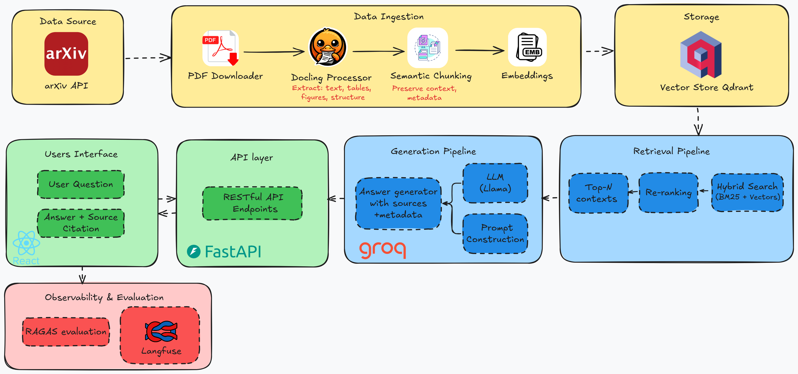

# AI Research Paper Navigator

**Intelligent RAG Research Assistant for arXiv Papers**

An end-to-end Retrieval-Augmented Generation (RAG) system that fetches, processes, and enables intelligent querying of AI/ML research papers from arXiv. Built with advanced document processing (Docling), hybrid search (BM25 + vector), cross-encoder re-ranking, and powered by Groq's ultra-fast LLM API.

---


## 🏗️ Architecture

### System Overview


*Complete system architecture showing data flow from arXiv ingestion through processing, storage, retrieval, and generation to user interface.*

### Component Details

**1. Data Ingestion Layer**
- **arXiv API**: Search and fetch paper metadata
- **PDF Downloader**: Download PDFs to local storage
- **Docling Processor**: Advanced PDF parsing with structure preservation
  - Extracts text with section hierarchy
  - Extracts tables as structured JSON
  - Extracts figures with captions and metadata
- **Semantic Chunking**: Splits documents into chunks (512 tokens) with overlap (50 tokens) while preserving context

**2. Storage Layer**
- **Qdrant Vector Store**: Stores document embeddings (384 dimensions) for semantic search
- **BM25 Index**: Inverted index for keyword-based lexical search
- **Metadata Storage**: Paper IDs, sections, citations, and chunk relationships

**3. Retrieval Layer**
- **Hybrid Retrieval**: Combines BM25 (lexical) and vector (semantic) search scores
  - Retrieves top-K candidates (default: 20)
  - Weighted combination of both search methods
- **Re-ranking**: Cross-encoder model refines relevance
  - Takes top-K candidates
  - Reranks to top-N most relevant contexts (default: 5)

**4. Generation Layer**
- **Prompt Engineering**: Constructs RAG prompt with:
  - Retrieved contexts with citations
  - User question
  - Response mode (default/technical/beginner-friendly)
- **Groq API**: Ultra-fast LLM inference
  - Model: llama-3.3-70b-versatile
  - Streaming support for real-time responses
  - Temperature: 0.1 (deterministic)

**5. Interface Layer**
- **React Frontend**: Modern web UI with:
  - Streaming response display
  - Citation tracking and source links
  - Query history management
  - Statistics dashboard
- **FastAPI Backend**: RESTful API with:
  - `/api/query` - Main query endpoint
  - `/api/health` - Health check
  - `/api/stats` - System statistics
  - Streaming support for real-time responses

**6. Observability & Evaluation**
- **Langfuse**: Tracks entire RAG pipeline
  - Query traces
  - API usage and latency
  - Token consumption
  - Error tracking
- **RAGAS**: Automated evaluation metrics
  - Faithfulness (answer grounded in context)
  - Relevancy (answer relevance to question)
  - Context precision (retrieval quality)

---

## ✨ Key Features

### Document Processing
- **📄 Advanced PDF Processing**: Extract text, tables, figures, and document structure using Docling (IBM Research)
- **📊 Structured Extraction**: Preserves paper sections, tables, figures, and citations with metadata
- **🔗 Context Preservation**: Maintains document hierarchy and relationships during chunking

### Retrieval & Search
- **🔍 Hybrid Retrieval**: Combines BM25 lexical search with dense vector embeddings for optimal relevance
- **🎯 Cross-Encoder Re-ranking**: Fine-tuned re-ranking model for precision (ms-marco-MiniLM-L-6-v2)
- **⚡ Fast Vector Search**: Qdrant vector database for sub-second retrieval
- **📈 Top-K + Top-N Strategy**: Retrieve top-K candidates, re-rank to top-N for final context

### LLM & Generation
- **⚡ Ultra-Fast LLM**: Groq API with llama-3.3-70b-versatile (500+ tokens/sec)
- **🌊 Streaming Responses**: Real-time token streaming for better UX
- **🎨 Multiple Response Modes**: Default, technical, and beginner-friendly modes
- **📝 Citation Tracking**: Automatic source attribution with paper references

### User Interface
- **🎨 Modern React Frontend**: Responsive web interface with real-time updates
- **🌊 Streaming UI**: Live token streaming with progress indicators
- **📚 Query History**: Save and manage previous queries
- **🎯 Source Highlighting**: Visual highlighting of retrieved contexts
- **📊 Statistics Dashboard**: System metrics and performance monitoring

### Observability & Evaluation
- **👁️ Langfuse Integration**: Complete RAG pipeline tracing and monitoring
- **📈 RAGAS Evaluation**: Automated quality metrics (faithfulness, relevancy, context precision)
- **📊 Performance Tracking**: API usage, latency, and cost monitoring
- **🔍 Debugging Tools**: Detailed trace logs for troubleshooting

### Deployment & Infrastructure
- **🐳 Docker Support**: Complete containerization with Docker Compose
- **🚀 Production Ready**: FastAPI backend with async support
- **🔧 Easy Configuration**: Environment-based configuration management
- **📦 Scalable Architecture**: Modular design for easy extension

---

## 🐳 Docker Quick Start (Recommended)

**Deploy the entire system with one command:**

```bash
# 1. Copy environment template
cp env.example .env

# 2. Edit .env and add your Groq API key
# GROQ_API_KEY=gsk_your_actual_key_here

# 3. Start all services (first run takes 10-15 minutes)
docker-compose up
```

**Access the application:**
- 🌐 **Frontend UI:** http://localhost:3000
- 🔧 **Backend API:** http://localhost:8000/docs
- 📊 **Qdrant Dashboard:** http://localhost:6333/dashboard

The system will automatically:
- ✅ Start Qdrant vector database
- ✅ Fetch and index research papers
- ✅ Initialize the RAG pipeline
- ✅ Launch the React frontend

---

## 📦 Technology Stack

| Component | Technology | Purpose |
|-----------|-----------|---------|
| **PDF Processing** | Docling | Extract text, tables, figures with structure |
| **LLM API** | Groq (llama-3.3-70b) | Ultra-fast inference (500+ tok/s) |
| **Vector Store** | Qdrant | High-performance vector database |
| **Embeddings** | Sentence-Transformers | all-MiniLM-L6-v2 model |
| **Lexical Search** | BM25 (rank-bm25) | Keyword-based retrieval |
| **Re-ranking** | Cross-Encoder | ms-marco-MiniLM-L-6-v2 |
| **Evaluation** | RAGAS | RAG quality metrics |
| **Observability** | Langfuse | Tracing and monitoring |
| **Backend API** | FastAPI | RESTful API with streaming |
| **Frontend** | React | Modern web interface |

---

## 🚀 Quick Start

### Prerequisites

- Python 3.10 or higher
- Node.js 16+ (for frontend)
- Groq API key (free tier: 14,400 requests/day)
- 4GB+ RAM recommended
- Docker & Docker Compose (optional, for containerized deployment)

### Option 1: Docker Deployment (Recommended)

The easiest way to get started is using Docker Compose:

```bash
# 1. Clone the repository
git clone <repository-url>
cd my-arxiv-paper-curator

# 2. Copy environment template
cp env.example .env

# 3. Edit .env and add your Groq API key
# GROQ_API_KEY=gsk_your_actual_key_here

# 4. Start all services
docker-compose up

# Access the application:
# - Frontend: http://localhost:3000
# - Backend API: http://localhost:8000/docs
# - Qdrant Dashboard: http://localhost:6333/dashboard
```

### Option 2: Local Development

#### Backend Setup

1. **Clone the repository**
   ```bash
   git clone <repository-url>
   cd my-arxiv-paper-curator
   ```

2. **Create virtual environment**
   ```bash
   python -m venv venv
   
   # Windows
   venv\Scripts\activate
   
   # Linux/Mac
   source venv/bin/activate
   ```

3. **Install Python dependencies**
   ```bash
   pip install -r requirements.txt
   ```

4. **Setup environment variables**
   ```bash
   # Copy the example file
   copy env.example .env  # Windows
   # or
   cp env.example .env    # Linux/Mac
   
   # Edit .env and add your API keys
   ```

5. **Get your Groq API key**
   - Visit: https://console.groq.com/keys
   - Create a free account
   - Generate an API key
   - Add to `.env`: `GROQ_API_KEY=gsk_...`

6. **Start Qdrant (Vector Database)**
   ```bash
   # Using Docker
   docker run -p 6333:6333 -p 6334:6334 qdrant/qdrant
   
   # Or use the docker-compose service
   docker-compose up qdrant
   ```

7. **Run the Backend API**
   ```bash
   # Start FastAPI server
   uvicorn src.api.server:app --reload --port 8000
   ```

#### Frontend Setup

1. **Navigate to frontend directory**
   ```bash
   cd frontend
   ```

2. **Install dependencies**
   ```bash
   npm install
   ```

3. **Start development server**
   ```bash
   npm start
   ```

4. **Access the application**
   - Frontend: http://localhost:3000
   - Backend API: http://localhost:8000/docs

### Running Demo Scripts

```bash
# Demo script
python demo.py
```

---

## 📁 Project Structure

```
my-arxiv-paper-curator/
├── src/                       # Backend source code
│   ├── config.py              # Configuration settings
│   ├── api/                   # FastAPI REST API
│   │   └── server.py          # Main API server with streaming
│   ├── data/                  # Data ingestion modules
│   │   ├── arxiv_client.py    # arXiv API wrapper
│   │   ├── docling_processor.py  # PDF → structured content
│   │   └── chunker.py         # Semantic chunking
│   ├── retrieval/             # Retrieval & search modules
│   │   ├── embedder.py        # Embedding generation
│   │   ├── vector_store.py    # Qdrant vector store wrapper
│   │   ├── bm25_index.py      # BM25 search
│   │   ├── hybrid_retriever.py # Hybrid search
│   │   └── reranker.py        # Cross-encoder re-ranking
│   ├── llm/                   # LLM integration
│   │   ├── groq_client.py     # Groq API client
│   │   └── prompts.py         # Prompt templates
│   ├── rag/                   # RAG pipeline
│   │   ├── pipeline.py        # End-to-end RAG flow
│   │   └── observable_pipeline.py  # RAG with observability
│   ├── evaluation/            # Evaluation modules
│   │   └── ragas_evaluator.py # RAGAS metrics
│   ├── observability/         # Tracking & monitoring
│   │   └── langfuse_client.py # Langfuse integration
│   └── ui/                    # User interface (not included - using React frontend)
├── frontend/                  # React frontend
│   ├── src/                   # React source code
│   │   ├── App.js             # Main app component
│   │   ├── config/            # Configuration
│   │   ├── hooks/             # Custom React hooks
│   │   ├── services/          # API services
│   │   └── utils/             # Utility functions
│   ├── public/                # Static assets
│   ├── package.json           # Node dependencies
│   └── Dockerfile            # Frontend Docker image
├── scripts/                   # Utility scripts
│   ├── fetch_and_index_papers.py  # Paper fetching script
│   └── run_evaluation.py     # Evaluation runner
├── tests/                     # Unit tests
├── data/                      # Data storage (gitignored)
│   ├── raw/                   # Downloaded PDFs
│   ├── processed/             # Extracted content
│   │   ├── texts/             # Markdown text
│   │   ├── tables/            # Table JSON
│   │   └── figures/           # Figure metadata
│   ├── vector_db/             # Vector database storage
│   └── evaluation/            # Evaluation results
├── qdrant_storage/            # Qdrant database (gitignored)
├── docker-compose.yml         # Docker Compose configuration
├── Dockerfile                 # Backend Docker image
├── requirements.txt           # Python dependencies
├── env.example                # Environment template
└── README.md                  # This file
```

---

## 🎯 Development Roadmap

### Phase 1: Setup & Infrastructure ✅
- [x] Project structure
- [x] Configuration management
- [x] Dependencies & environment
- [x] Groq API key setup

### Phase 2: Data Ingestion Pipeline ✅
- [x] arXiv API client
- [x] PDF downloader
- [x] Docling processor (text + tables + figures)
- [x] Structured chunking with context preservation
- [x] Metadata enrichment

### Phase 3: Vector Store & Retrieval ✅
- [x] Embedding generation (sentence-transformers)
- [x] Qdrant vector database setup
- [x] BM25 index implementation
- [x] Hybrid retrieval system

### Phase 4: RAG with Groq ✅
- [x] Groq client integration
- [x] RAG prompt templates
- [x] Streaming support
- [x] Q&A pipeline

### Phase 5: Re-ranking ✅
- [x] Cross-encoder integration
- [x] Re-ranking pipeline
- [x] Performance optimization

### Phase 6: Enhanced UI ✅
- [x] React frontend with streaming
- [x] Citation display with paper sections
- [x] Table/figure preview
- [x] Source highlighting
- [x] Query management

### Phase 7: Observability ✅
- [x] Langfuse setup
- [x] RAG pipeline tracing
- [x] API usage & latency tracking

### Phase 8: Evaluation ✅
- [x] RAGAS evaluation framework
- [x] Test dataset generation
- [x] Metrics: faithfulness, relevancy, context precision

### Phase 9: Frontend Development ✅
- [x] React application setup
- [x] API integration
- [x] Streaming response handling
- [x] UI components and styling

### Phase 10: Backend API ✅
- [x] FastAPI server implementation
- [x] RESTful endpoints
- [x] Streaming support
- [x] CORS configuration

### Phase 11: Full Stack Integration ✅
- [x] Frontend-Backend connection
- [x] Error handling
- [x] Authentication flow
- [x] State management

### Phase 12: Docker Deployment ✅
- [x] Dockerfile for backend
- [x] Dockerfile for frontend
- [x] Docker Compose configuration
- [x] Multi-container orchestration

### Phase 13: Polish & Documentation ✅
- [x] Code cleanup
- [x] Comprehensive README
- [x] Architecture documentation
- [x] Deployment guides

---

## ⚙️ Configuration

Key settings in `.env`:

```bash
# Required
GROQ_API_KEY=gsk_your_api_key_here

# Optional
GROQ_MODEL=llama-3.3-70b-versatile  # or mixtral-8x7b-32768
ARXIV_QUERY=cat:cs.AI OR cat:cs.LG
ARXIV_MAX_RESULTS=10

# Langfuse (optional, for observability)
LANGFUSE_PUBLIC_KEY=pk_...
LANGFUSE_SECRET_KEY=sk_...
```

See `env.example` for all available options.

---

## 🧪 Testing

```bash
# Run all tests
pytest

# Run with coverage
pytest --cov=src --cov-report=html

# Run specific test file
pytest tests/test_arxiv_client.py
```

---

## 📊 Usage Examples

### Using the React Frontend

1. **Start the application** (see Quick Start above)
2. **Access the UI** at http://localhost:3000
3. **Enter your query** in the search box
4. **View results** with citations and source highlighting
5. **Check query history** in the sidebar

### Using the Backend API

#### Query Endpoint

```bash
curl -X POST "http://localhost:8000/api/query" \
  -H "Content-Type: application/json" \
  -d '{
    "question": "What are the main innovations in transformer architecture?",
    "top_k": 20,
    "mode": "default",
    "use_reranker": true,
    "stream": false
  }'
```

#### Streaming Query

```bash
curl -X POST "http://localhost:8000/api/query" \
  -H "Content-Type: application/json" \
  -d '{
    "question": "Explain attention mechanisms in transformers",
    "stream": true
  }' \
  --no-buffer
```

#### Health Check

```bash
curl http://localhost:8000/api/health
```

### Using Python API

```python
from src.rag.pipeline import RAGPipeline

# Initialize pipeline
rag = RAGPipeline()

# Fetch and index papers
rag.fetch_papers(query="cat:cs.AI OR cat:cs.LG", max_results=10)

# Ask questions
response = rag.query(
    question="What are the main innovations in transformer architecture?",
    top_k=20,
    use_reranker=True
)

print(response.answer)
print(f"Sources: {len(response.contexts)} contexts retrieved")
for ctx in response.contexts:
    print(f"- {ctx['paper_id']}: {ctx['section']}")
```


---

## 🤝 Contributing

Contributions are welcome! Please follow these steps:

1. Fork the repository
2. Create a feature branch (`git checkout -b feature/amazing-feature`)
3. Commit your changes (`git commit -m 'Add amazing feature'`)
4. Push to the branch (`git push origin feature/amazing-feature`)
5. Open a Pull Request

---

## 📝 License

This project is licensed under the MIT License - see the LICENSE file for details.

---

## 🙏 Acknowledgments

- **Docling**: IBM Research for advanced PDF processing
- **Groq**: Ultra-fast LLM inference
- **ChromaDB**: Efficient vector storage
- **LangChain**: RAG framework components
- **RAGAS**: RAG evaluation framework
- **Langfuse**: Observability platform

---

## 📧 Contact

For questions or feedback, please open an issue on GitHub.

---

**Built with ❤️ for AI/GenAI Engineering**

